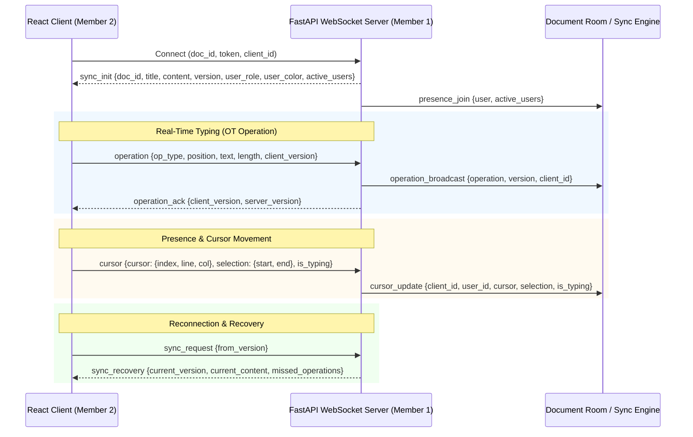

# WebSocket Real-Time Protocol Specification

## Connection URL
```
ws://localhost:8000/api/v1/ws/documents/{document_id}?token={jwt_token}&client_id={optional_client_id}
```

## Handshake & Lifecycle



---

## Message Types (Client -> Server)

### 1. Send Edit Operation (`operation`)
```json
{
  "type": "operation",
  "operation": {
    "op_type": "insert",
    "position": 14,
    "text": "hello world",
    "client_version": 2
  }
}
```
*For Deletion:*
```json
{
  "type": "operation",
  "operation": {
    "op_type": "delete",
    "position": 10,
    "length": 5,
    "client_version": 2
  }
}
```

### 2. Send Cursor & Selection (`cursor`)
```json
{
  "type": "cursor",
  "cursor": { "index": 24, "line": 2, "column": 10 },
  "selection": { "start": 20, "end": 24 },
  "is_typing": true
}
```

### 3. Reconnect Catch-up (`sync_request`)
```json
{
  "type": "sync_request",
  "from_version": 12
}
```

### 4. Heartbeat Ping (`ping`)
```json
{
  "type": "ping"
}
```

---

## Message Types (Server -> Client)

### 1. Initial State (`sync_init`)
```json
{
  "type": "sync_init",
  "document_id": 1,
  "title": "Caveman Manifesto",
  "content": "Tribe Rules: 1. Make fire.",
  "version": 3,
  "user_role": "editor",
  "user_color": "#FF5722",
  "active_users": [
    {
      "user_id": 1,
      "client_id": "alice_cli",
      "name": "Alice Cave",
      "email": "alice@tribe.com",
      "color": "#FF5722",
      "cursor": { "index": 12 },
      "selection": null,
      "is_typing": false,
      "last_seen": 1724545000.0
    }
  ]
}
```

### 2. Operation Broadcast (`operation_broadcast`)
```json
{
  "type": "operation_broadcast",
  "operation": {
    "op_type": "insert",
    "position": 14,
    "text": "hello world",
    "client_id": "bob_cli",
    "client_version": 2,
    "server_version": 4,
    "doc_id": 1
  },
  "version": 4,
  "client_id": "bob_cli"
}
```

### 3. Operation Acknowledgment (`operation_ack`)
```json
{
  "type": "operation_ack",
  "client_version": 2,
  "server_version": 4
}
```

### 4. Remote Cursor Update (`cursor_update`)
```json
{
  "type": "cursor_update",
  "client_id": "bob_cli",
  "user_id": 2,
  "cursor": { "index": 25, "line": 2, "column": 11 },
  "selection": null,
  "is_typing": true
}
```

### 5. Collaborator Joined / Left
```json
{
  "type": "presence_join",
  "user": { "user_id": 2, "name": "Bob Cave", "color": "#4CAF50" },
  "active_users": [...]
}
```
```json
{
  "type": "presence_leave",
  "client_id": "bob_cli",
  "user_id": 2,
  "active_users": [...]
}
```
